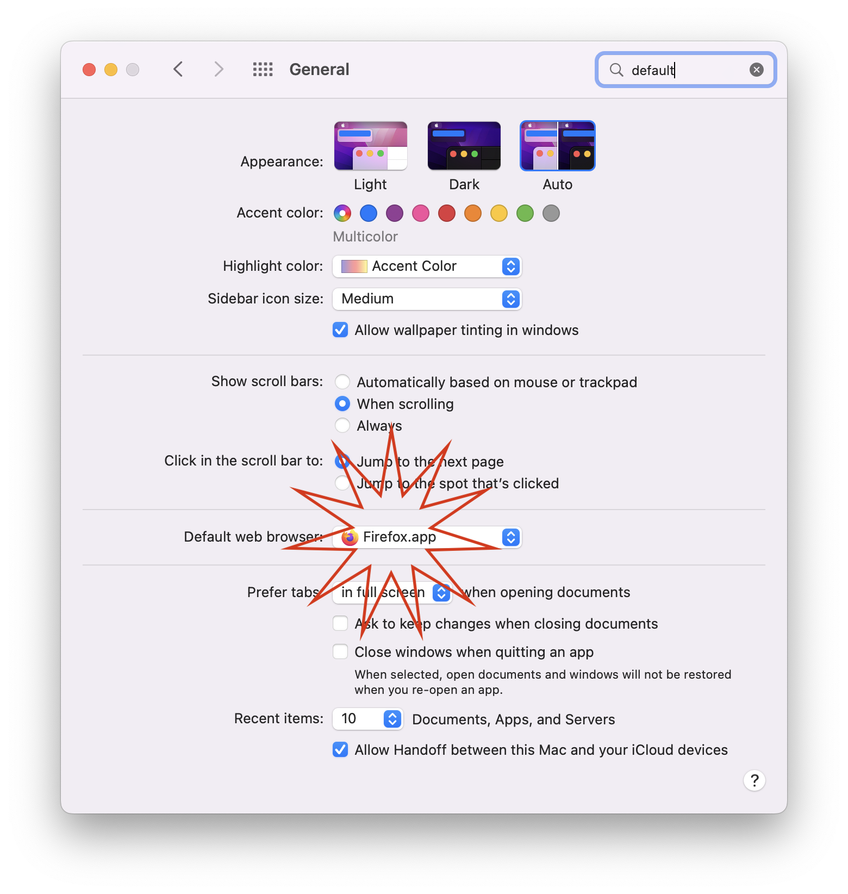
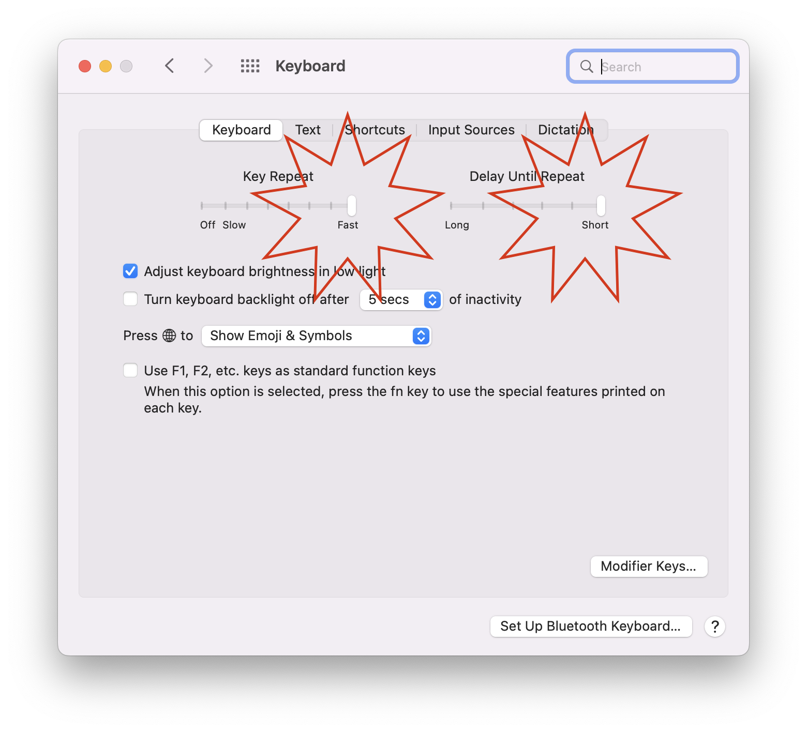
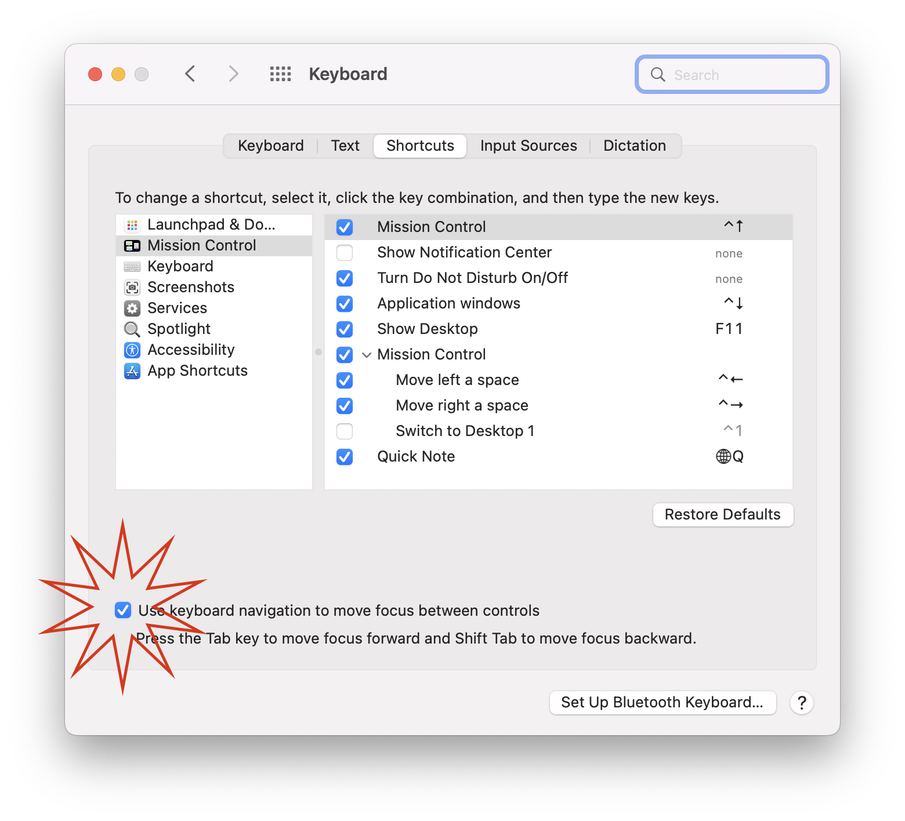

Hello! This is a companion guide to a YouTube video I am making. I will update this post with the link once it's available.

This post will be a pretty straightforward reference; I won't elaborate on or justify my choices here like I do in the video.

This is an opinionated guide; you're not obliged to do everything on this list, or necessarily in order. I have chosen these steps in this way to minimize ambiguity, while still setting you up for success.

Click each of the following sections to maximize them.

<Accordion allowMultipleExpanded allowZeroExpanded>
  <AccordionItem>
    <AccordionItemHeading>
      <AccordionItemButton>
        <h3>Install and configure Firefox</h3>
      </AccordionItemButton>
    </AccordionItemHeading>
    <AccordionItemPanel>

- Visit [https://www.mozilla.org/en-US/firefox/new/](https://www.mozilla.org/en-US/firefox/new/) to download and install Firefox.

- Open System Preferences. You can open System Preferences by clicking the apple logo at the top left of your screen, or using Spotlight Search.

- Open the "General" preferences.

- Select Firefox as your default browser.

- Go back and open the keyboard settings in System Preferences.

- Move the key repeat and delay until repeat sliders all the way to the right.

- Go to the shortcuts tab and enable keyboard navigation.

</AccordionItemPanel>
  </AccordionItem>
  <AccordionItem>
    <AccordionItemHeading>
      <AccordionItemButton>
        <h3>Install uBlock Origin</h3>
      </AccordionItemButton>
    </AccordionItemHeading>
    <AccordionItemPanel>
      Visit <a href="https://addons.mozilla.org/en-US/firefox/addon/ublock-origin/">https://addons.mozilla.org/en-US/firefox/addon/ublock-origin/</a> to download and install uBlock Origin.
    </AccordionItemPanel>
  </AccordionItem>
  <AccordionItem>
    <AccordionItemHeading>
      <AccordionItemButton>
        <h3>Install Chrome</h3>
      </AccordionItemButton>
    </AccordionItemHeading>
    <AccordionItemPanel>
      

        Visit <a href="https://www.google.com/chrome/">https://www.google.com/chrome/</a>. Download and install Chrome. Do <em>not</em> set it as your default browser.
      

    </AccordionItemPanel>
  </AccordionItem>
  <AccordionItem>
    <AccordionItemHeading>
      <AccordionItemButton>
        <h3>Install VSCode</h3>
      </AccordionItemButton>
    </AccordionItemHeading>
    <AccordionItemPanel>
      <ul>
        <li>Visit <a href="https://code.visualstudio.com">https://code.visualstudio.com</a> to install VSCode.</li>
        <li>Once it is open, install the Prettier extension and set it as your formatter. Also, format on save.</li>
      </ul>
    </AccordionItemPanel>
  </AccordionItem>
  <AccordionItem>
    <AccordionItemHeading>
      <AccordionItemButton>
        <h3>Open and configure your your shell</h3>
      </AccordionItemButton>
    </AccordionItemHeading>
    <AccordionItemPanel>
      <ul>
        <li>Open Terminal from Spotlight search by pressing the command key and space bar at the same time, then typing "Terminal". Then press enter to open it.</li>
        <li>run <code>code ~/.zshrc</code></li>
        <li>add <code>which -s code && export EDITOR="code --wait"</code></li>
        <li>Install XCode with <code>xcode-select --install</code></li>
      </ul>
    </AccordionItemPanel>

  </AccordionItem>
  <AccordionItem>
    <AccordionItemHeading>
      <AccordionItemButton>
        <h3>Install Homebrew</h3>
      </AccordionItemButton>
    </AccordionItemHeading>
    <AccordionItemPanel>
      Visit <a href="https://brew.sh/">https://brew.sh/</a> and copy the installation script. Paste it in terminal and press enter.
    </AccordionItemPanel>
  </AccordionItem>
  <AccordionItem>
    <AccordionItemHeading>
      <AccordionItemButton>
        <h3>Install nvm</h3>
      </AccordionItemButton>
    </AccordionItemHeading>
    <AccordionItemPanel>Visit <a href="https://github.com/nvm-sh/nvm#installing-and-updating">https://github.com/nvm-sh/nvm</a> and copy the install script. Paste it in terminal and press enter.</AccordionItemPanel>
  </AccordionItem>
  <AccordionItem>
    <AccordionItemHeading>
      <AccordionItemButton>
        <h3>Install Node</h3>
      </AccordionItemButton>
    </AccordionItemHeading>
    <AccordionItemPanel>
      In the terminal, write <code>nvm install --lts</code> and press enter.
    </AccordionItemPanel>
  </AccordionItem>
  <AccordionItem>
    <AccordionItemHeading>
      <AccordionItemButton>
        <h3>Install create-react-app</h3>
      </AccordionItemButton>
    </AccordionItemHeading>
    <AccordionItemPanel>In terminal, write <code>npm i -g create-react-app</code> and press enter.</AccordionItemPanel>
  </AccordionItem>
  <AccordionItem>
    <AccordionItemHeading>
      <AccordionItemButton>
        <h3>Create and run your React project</h3>
      </AccordionItemButton>
    </AccordionItemHeading>
    <AccordionItemPanel>
      

        
Run these commands in order:

        <ul>
          <li><code>create-react-app your-app-name</code></li>
          <li><code>cd your-app-name</code></li>
          <li><code>code .</code></li>
          <li><code>npm start</code></li>
        </ul>
        
This will open your browser with your first React project.

      

    </AccordionItemPanel>
  </AccordionItem>
</Accordion>

That should do it! Please let me know if you encounter any errors or inconsistences in these instructions.
