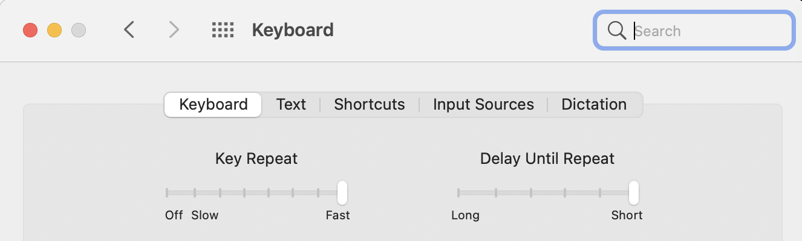

This guide is specific to MacOS because that's what I know, and I can guarantee that these shortcuts work out of the box on a fresh install. A lot of them will work for Windows as well, replacing command with the Windows key or control.

For most developers, the practice of software development is, at a basic level, typing. There are other ways of interacting with the computer, such as voice recognition software, which can be especially useful for disabled people. I am not an expert in that, though, so I will focus on the keyboard.

While programming _is_ typing, typing is not the _point_ of programming. As such, many developers learn to interact efficiently with computers via keyboard shortcuts, bypassing the mouse as much as possible. This may seem like a marginal and pointless task at first (it did to me!), but building flow and fluency with the medium becomes more valuable over time.

If you are a new programmer, do not try to learn and incorporate all of these at once! It took years for me to add these to my repertoire, and I am still learning.

Here's a quick glossary. The key combinations that make up a shortcut can be called _chords_, which I think sounds cool. And if holding down a key modifies the behavior of another key or chord, it is called a _modifier key_. The shift key is a modifier that everyone knows; it turns lower case letters into upper case letters.

I will start with a list of the most useful that you can get started with right away, and then delve into an exhaustive list. But first, go to keyboard settings and move the "key repeat" and "delay until repeat" sliders all the way to the right. This is one of the first things I do on a new Mac, and it automatically makes it feel ten times more responsive.

I use some custom shortcuts for specific programming tasks that I will not list here. I tend to prefer doing shortcuts with just my left hand, so sometimes I'll remap an existing shortcut to enable that. For example, `cmd + p` in VSCode opens the fuzzy finder, but I've remapped it to `cmd + t`.

Note that oftentimes, adding shift to a chord will perform the opposite of the normal action. For example, `cmd + tab` selects the next application, and `cmd + shift + tab` selects the previous application. I won't list this shift modifier exhaustively.

## Most useful shortcuts (start here!)

| Shortcut        | Description                                                |
| --------------- | ---------------------------------------------------------- |
| `cmd + tab`     | Switch apps. Hold down `cmd` and tap `tab` to keep moving. |
| `cmd + space`   | Open Spotlight search                                      |
| `cmd + p`       | Open fuzzy finder in VSCode                                |
| `up/down arrow` | Move through command history in terminal                   |

## Global shortcuts for MacOS

These work in the global MacOS context or in a majority of apps.

| Shortcut          | Description                                                |
| ----------------- | ---------------------------------------------------------- |
| `cmd + tab`       | Switch apps. Hold down `cmd` and tap `tab` to keep moving. |
| `cmd + tilde`     | Switch windows in current app                              |
| `cmd + space`     | Open Spotlight search                                      |
| `cmd + w`         | Close current window or tab                                |
| `cmd + q`         | Quit current application                                   |
| `cmd + +/-`       | Zoom in/out                                                |
| `cmd + ,`         | Open current app preferences or settings                   |
| `cmd + shift + 4` | Take a screenshot of part of the screen                    |

## Terminal

I still don't really know the difference between `ctrl + d` and `ctrl + c`, but mashing one or both will reliably end a process in terminal.

| Shortcut          | Description                          |
| ----------------- | ------------------------------------ |
| `ctrl + c`        | End current program                  |
| `ctrl + d`        | End current program                  |
| `ctrl + a`        | Move cursor to beginning of the line |
| `up/down arrow`   | move through command history         |
| `tab`             | Autocomplete current file or command |
| `cmd + t`         | Open new tab                         |
| `cmd + shift + [` | Move one tab left                    |
| `cmd + shift + ]` | Move one tab right                   |

## Text editing stuff

These work for most text editing contexts, like VSCode, SublimeText, Google Docs, or any old text box on a web page. They will not work in the terminal, vim, or emacs.

Note that holding shift while doing any cursor movement (word-by-word or line-by-line) will select as you go. This can be powerful for copying large blocks of text.

| Shortcut                    | Description                                   |
| --------------------------- | --------------------------------------------- |
| `shift + direction key`     | select text in that direction                 |
| `cmd + direction key`       | move the cursor all the way in that direction |
| `option + left/right arrow` | move one word to the left/right               |
| `cmd + a`                   | select all the text                           |
| `cmd + c`                   | copy selection to clipboard                   |
| `cmd + v`                   | paste clipboard contents                      |
| `cmd + z`                   | undo                                          |
| `cmd + s`                   | save                                          |
| `cmd + f`                   | find on page                                  |

The following are specific to VSCode and similar code editors.

| Shortcut                       | Description                               |
| ------------------------------ | ----------------------------------------- |
| `cmd + shift + z` or `cmd + y` | redo                                      |
| `cmd + d`                      | select next instance of current selection |
| `cmd + click`                  | place new cursor                          |
| `cmd + shift + f`              | open global find                          |
| `cmd + shift + e`              | open and close file tree sidebar          |
| `cmd + p`                      | open fuzzy finder                         |

## Browser

I could write a whole series of articles on the importance of tab navigation, including its role in accessibility and discoverability. In short, it's very important and useful, but two of the main browsers have it disabled by default. Make sure you enable it!

1. **Safari**

   Safari Preferences > Advanced > Press Tab to highlight each item on a webpage.

   While you're in the advanced menu, select "Show full website address" and "Show Develop menu in menu bar". This will make web development in Safari much easier.

2. **Firefox**

   System Preferences > Keyboard > Shortcuts > Use keyboard navigation to move focus between controls (at the bottom of the window)

3. **Chrome**

   Tab navigation is enabled by default in Chrome.

| Shortcut                 | Description                                   |
| ------------------------ | --------------------------------------------- |
| `tab`                    | focus next focusable element (see note above) |
| `cmd + t`                | open new tab                                  |
| `cmd + w`                | close current tab                             |
| `cmd + shift + t`        | reopen most recently closed tab               |
| `cmd + l`                | focus URL bar                                 |
| `cmd + shift + [`        | move one tab left                             |
| `cmd + shift + ]`        | move one tab right                            |
| `cmd + left/right arrow` | go back/forward                               |
| `cmd + option + i`       | open/close dev tools                          |
| `escape` (in dev tools)  | open/close JS console                         |

## Miscellaneous

Here are a last few useful tidbits for specific apps.

| Shortcut        | Description                                                |
| --------------- | ---------------------------------------------------------- |
| `shift + enter` | In gmail and other messaging services send current message |
| `t`             | In a GitHub repo, open file finder                         |
